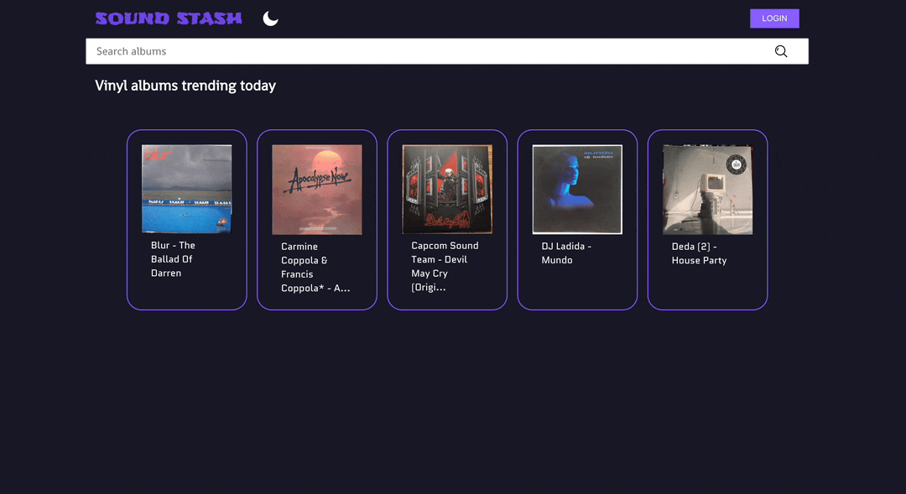
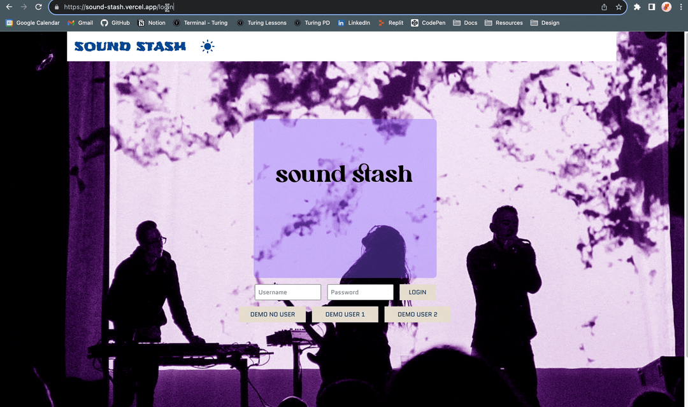
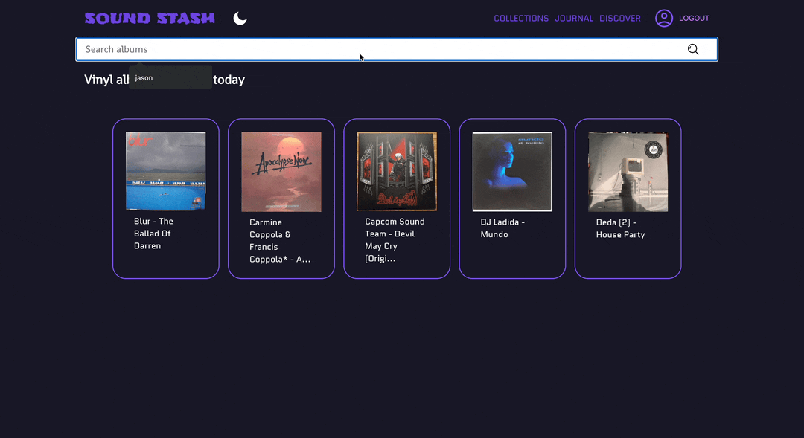

<h1> SOUND STASH </h1>
A vinyl collectors resource
  

 
<b>Built With:</b>
 

  
   
   
  
  
 

[DEPLOYED LINK](https://sound-stash-mu.vercel.app/) <!-- LINK TO BE ADDED ONCE DEPLOYED-->

## Abstract: 
This is a vinyl collectors website that uses the fetch API to get information from the [discogs-api](https://www.discogs.com/developers) and diplay that data to our users. The web app allows users to login using demo users, search for music, save vinyl albums to a collection, add journal entries for specific albums, and discover new music aligned with the users saved music preferences. If there is no user logged in, the public can still search for vinyl albums and view the albums details. The app features network requests to access information about vinyl albums and utilizes react router to create a multi-page experience, tested using Cypress.

## Preview of App:

  <h2> Mobile Display: </h2>

   <!-- ADD phone preview here -->

     

  <h2> Log a Journal Entry: </h2>

   <!-- ADD journal preview here -->

   

  <h2> Bad URL & Empty State: </h2>

   <!-- ADD sad path preview here -->

   

  <h2> Search: </h2>

   <!-- ADD search preview here -->

## Installation Instructions 
- Fork [this](https://github.com/mbenfowler/sound-stash) repository. 
- Clone it to your local machine using the command: `git clone git@github.com:mbenfowler/sound-stash.git`.
- Run the command: `cd sound-stash`
- Run the command: `npm install`
- Run the command: `npm start`
- Once the modules have finished compiling, enter `http://localhost:3000/` into your browser to see the live web page. 

## Context: 
- Mod 3, Week 4: 
  - We are current students of Turing School of Software & Design. 
  - Turing is a 7 month program, which offers a total of 4 modules. 
  - This project was completed during the third module that the program has to offer. 
  - Students are required to pick from a list of new tech to learn and implement.
    - Global State Mangement was selected as the tech stretch - Context API was implemented due to the small app size. 

- A total of approximately 60 hours was spent on this project between 4 contributors. 

## Contributors: 
- [Jason Alberto](https://github.com/jalbe0076)

- [Matt Fowler](https://github.com/mbenfowler)

- [Alec Livaditis](https://github.com/alivaditis)

- [Josh Martin](https://github.com/jmartin777)

## Learning Goals:
- Pick and learn a new tech withing the alloted time and implement it into the project 
- Create a user interface that is easy to use and clearly displays information
- Write DRY, reusable code that follows SRP and trends toward function purity
- Make network requests (using fetch API)
- Further improve React fundamentals
- Test React components & asynchronous JS
- Practice refactoring
- Create a multi-page UX using Router
